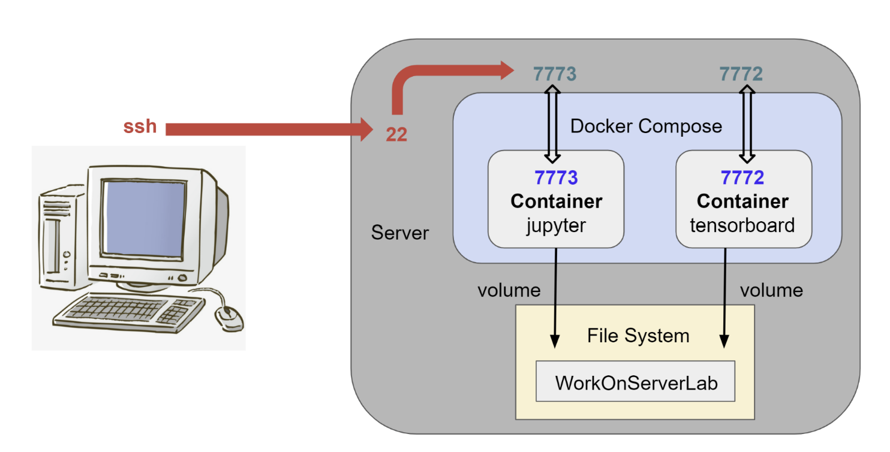

# WorkOnServerLab

## Framework


## Step
>  1. 創建 jupyter notebook 的 Dockerfile
>  2. 創建 tensorboard 的 Dockerfile
>  3. 撰寫 docker-compose.yml 檔
>  4. 使用 docker compose 同時執行兩個 container ，並透過 volume 存取位於 server 上 /home/jett/WorkOnServerLab 資料夾
>  5. jupyter container 將 training 過程撰寫 log file 儲存於 WorkOnServerLab file，tensorboard container 再去讀取 WorkOnServerLab file 裡面的 log 檔，利用 tensorboard 將圖表顯示出來

## Port forwarding
● host 7773 -> jupyter container 7773

● host 7772 -> tensorboard container 7772

## 執行 Compose 
run containers：
```shell=
    docker-compose up -d
```
stop containers：
```shell=
    docker-compose stop
```

## 進入正在執行的 container 
```shell=
    docker exec -it  [container name] bash
```

## 確認 port 有被開出來
```shell=
    curl [url]
```

## 開啟 jupyter notebook 
```shell=
    jupyter notebook -ip 0.0.0.0 --port [指定port] --allow-root --no-browser
```

## 開啟 tensorboard 
```shell=
    tensorboard --logdir .[path] --host=0.0.0.0 --port=[指定 port]
```
